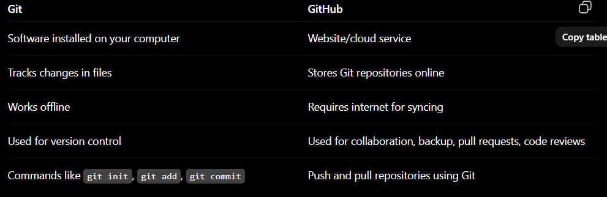

git software version control tool
github cloud platform use git for dev

git architecture :

Working Directory
this is the wrkdir (git)
        ▼
Staging Area
clipboard is staging area where the copied text is store (temporary)
        │
        ▼
Local Repository 
our current direc in our system
        │
        ▼
Remote Repository (GitHub)

git add selects the changes (choose what changes should be saved next)
git commit records them permanently (actually save those chosen changes)

COMMAND FLOW
git init
git status
git add FILENAME or git add. (EVERYTHING IN THE CURRENT FOLDER OR A  SUBFOLDER) OR ..(FROM PARENT DIR ALL ADDED)
git commit -m "Initial commit"
git remote add origin <repository-url>
git push -u origin main