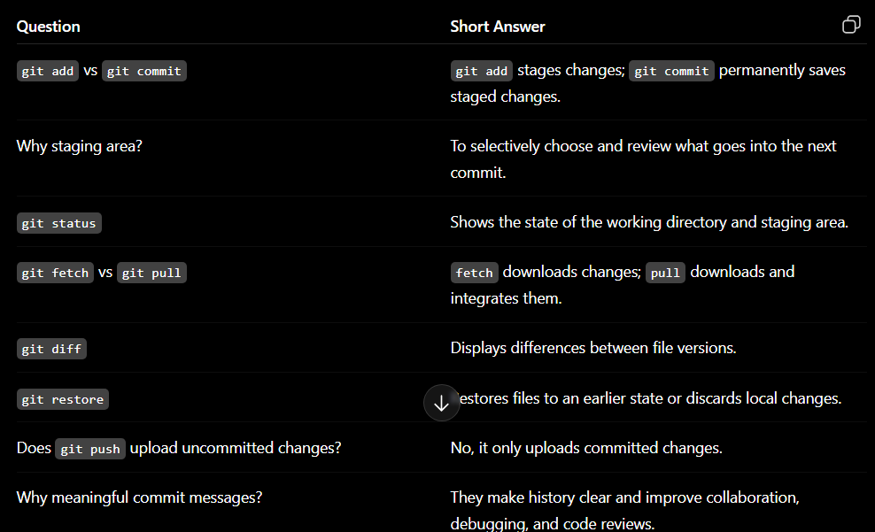

Why not commit directly?
Because the staging area lets you choose exactly which changes belong in a commit.

git restore- discard your edits.
git rm-Remove a tracked file
git mv-Rename or move a file while preserving Git history.
git mv old.txt new.txt

Local Repository
        │
        ▼
    GitHub
git push -u origin

This is useful when you want to inspect incoming changes before integrating them. git fetch

git fetch
      +
git merge  ==> git pull                                                            

