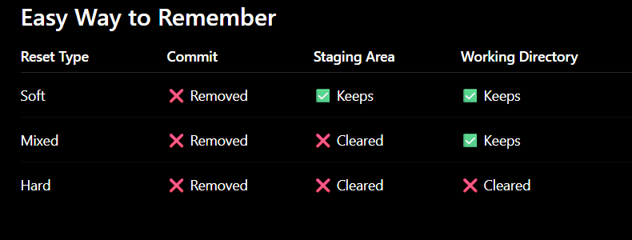

git rebase -- rewrites history to create a clean, completely linear timeline  

**Knowing how to recover safely is what separates a beginner from a professional.**

git reset
git revert
git stash
git reflog
git checkout
git switch
git restore
------------------------------------------------------
What am I trying to undo?
There are four possibilities:
1 Undo changes in the Working Directory
2 Undo changes in the Staging Area
3 Undo the last commit
4 Undo a commit already pushed to GitHub
Each situation has a different command.
-----------------------------------------------------------
You haven't staged or committed it. ---  git restore app.py
Git restores the file from the last commit.
git reset 3 types soft hard mixed
git reset ---it moves the haed to another commit(version)
A ---- B ---- C ---- D
                   ↑
                 HEAD          current 

git reset HEAD~1        default (mixed)

A ---- B ---- C
              ↑
            HEAD    

The commit D is no longer the current commit. no longer a branch which means its still alive in git db but no branch points to it (you can still recover the D)

----------------------------------------------------------
git reflog unique sha identifier for d (use to recover)

git reset --hard HEAD~1 ( d removed)
 git reset --soft HEAD~1 (d removed from branch history but changes are still remain staged)

-----------------------------------------------------------
REVERT 
Use git reset for commits that haven't been shared.
Use git revert for commits that have already been pushed and shared.

git revert C

Git creates a new commit:

A ---- B ---- C ---- D

Where D reverses the changes introduced by C.

-----------------------------------------------------------

GIT STASH
git stash
Git temporarily stores your changes and returns your working directory to the last committed state.
git stash pop
Your saved work comes back.
-----------------------------------------------------------

GIT SWITCH CHANGING FROM 1 TO ANOTHER BRANCH
git switch MAIN (branch) & CREATE ND SWITCH git switch feature/login

git restore---- restoring a **file **

git checkout old to change from 1 to another like branch git switch

