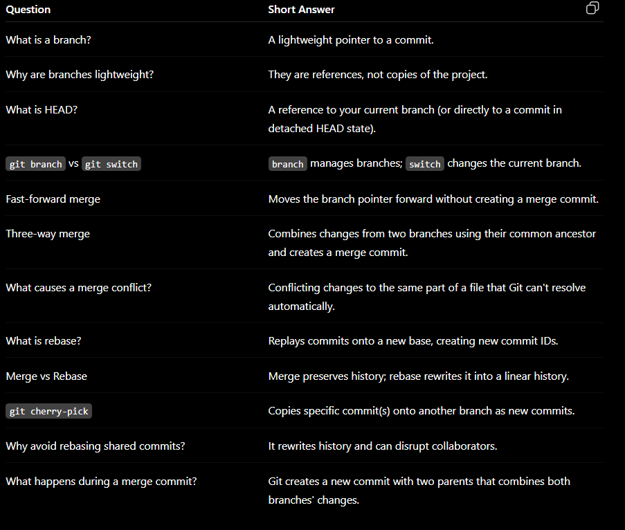

BRANCH - COPY OF A PROJ (REFERENCE OF THE PROJ SO LIGHTWEIGHT)
CREATE BRANCH : git branch BRANCHNAME
1 branch to another : GIT SWITCH BRANCHNAME 
CREATE AND SWITCH SAME TIME -- git switch -c branchname
MERGE - git merge branchnametobemerged
git branch -d feature/login (LOCAL)
git push origin --delete feature/login(GITHUB)
use git cherry-pick <commit-id> to apply just that commit

